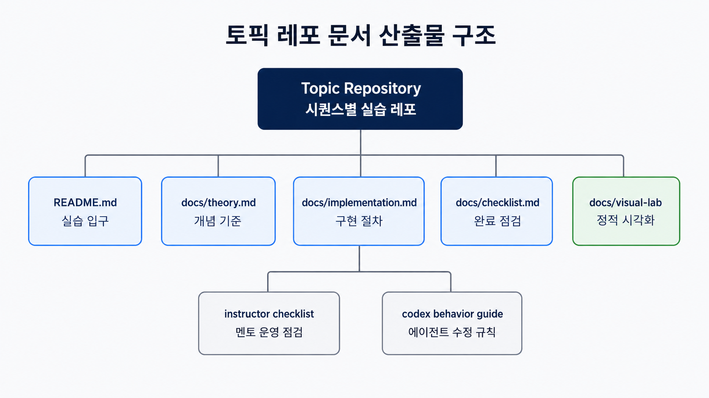

# A&I 4기 Code Lab Central Hub

> 본 저장소는 A&I 4기 백엔드 코드랩의 시퀀스, 브랜치 전략, 실습 산출물 기준을 관리하는 중앙 허브입니다.

## 1. 왜 중앙 허브가 필요한가

본 프로젝트는 여러 토픽 레포로 나뉜 백엔드 코드랩을 같은 운영 기준으로 진행하기 위해 만들었습니다.
중앙 허브는 전체 순서, 브랜치 명명 규칙, 실습 문서 형식을 고정해 학생과 멘토가 같은 흐름으로 수업을 읽고 비교하게 합니다.

- 시퀀스 기준: [docs/manifest/sequences.yml](./docs/manifest/sequences.yml)
- 학생 시작 문서: [docs/student/how-to-use-this-course.md](./docs/student/how-to-use-this-course.md)
- 멘토 점검 문서: [docs/instructor/checklist.md](./docs/instructor/checklist.md)
- 자동화 에이전트 규칙: [docs/agent/codex-behavior-guide.md](./docs/agent/codex-behavior-guide.md)

## 2. 한눈에 보는 커리큘럼

커리큘럼 순서는 [manifest](./docs/manifest/sequences.yml)를 기준으로 관리합니다.
README에는 전체 흐름만 남기고, 세부 범위는 [docs/sequences](./docs/sequences)와 각 토픽 레포의 문서에서 관리합니다.

1. 00 Prerequisite
2. 01 REST CRUD
3. 02 DB Access
4. 03 Validation
5. 04 JWT
6. 05 OAuth2 + SMTP
7. 06 Testing
8. 07 Redis Cache
9. 08 Realtime WebSocket
10. 09 Docker/Runtime
11. 10 CI/CD Deployment
12. 11 Refactoring Foundation
13. 12 Event Driven

운영자는 01 REST CRUD와 12 Event Driven의 GitHub 원격 default branch가 `main`인지 수동으로 확인해야 합니다.
Codex는 GitHub 원격 default branch를 직접 바꾸지 못합니다.

원본 다이어그램: [curriculum-map.drawio](./docs/assets/diagrams/curriculum-map.drawio)

## 3. 브랜치 기반 학습 흐름

학생은 각 토픽 레포의 `NN-implementation` 브랜치에서 실습을 시작합니다.
구현과 테스트를 마친 뒤 `NN-answer` 브랜치와 diff를 비교하며 놓친 설계 의도와 구현 차이를 회고합니다.

원본 다이어그램: [branch-strategy.drawio](./docs/assets/diagrams/branch-strategy.drawio)

## 4. 문서 산출물 구조

각 토픽 레포는 같은 문서 골격을 유지합니다.
학생은 `README.md`, `docs/theory.md`, `docs/implementation.md`, `docs/checklist.md`, `docs/visual-lab` 순서로 학습하고, 멘토와 에이전트는 instructor checklist와 codex behavior guide로 운영 기준을 확인합니다.

원본 다이어그램: [document-structure.drawio](./docs/assets/diagrams/document-structure.drawio)

## 5. 학생과 멘토가 읽는 방법

| 대상 | 먼저 읽는 문서 | 확인할 내용 |
| --- | --- | --- |
| 학생 | [docs/student/how-to-use-this-course.md](./docs/student/how-to-use-this-course.md) | 오늘의 토픽 레포, `NN-implementation` 시작 방식, 실습 순서 |
| 멘토 | [docs/instructor/checklist.md](./docs/instructor/checklist.md) | 수업 전후 점검, 리뷰 관점, answer 비교 안내 |
| 운영자 | [docs/manifest/sequences.yml](./docs/manifest/sequences.yml) | 시퀀스 순서, 토픽 레포, 브랜치, 실행 및 테스트 명령 |
| 자동화 에이전트 | [docs/agent/codex-behavior-guide.md](./docs/agent/codex-behavior-guide.md) | 수정 범위, 금지 사항, 검증 규칙 |

## 6. 이력서에 연결할 문장

- A&I 4기 백엔드 코드랩의 중앙 허브 레포를 설계해 시퀀스 순서, 브랜치 전략, 실습 산출물 기준을 관리했습니다.
- 학생이 `NN-implementation` 브랜치에서 실습하고 `NN-answer` 브랜치와 diff로 비교하는 학습 흐름을 구성했습니다.
- theory, implementation, checklist, visual-lab 문서 구조를 기준으로 다음 기수도 재사용할 수 있는 교육 자료 체계를 남겼습니다.
