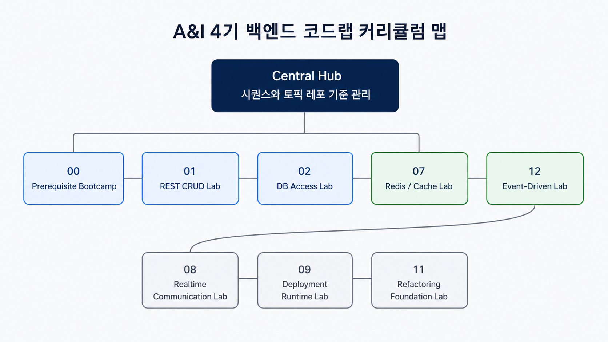
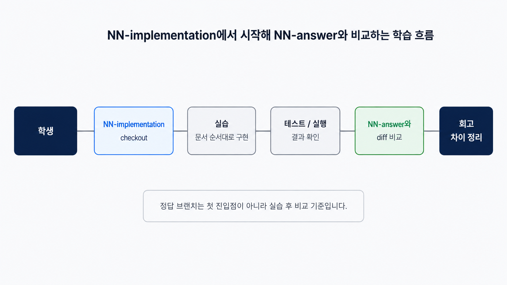

# A&I 4기 Code Lab Central Hub

> A&I 4기 백엔드 코드랩의 학습 순서, 브랜치 전략, 문서 산출물, 수업 전 검증 기준을 관리하는 중앙 운영 레포입니다.

## 1. 프로젝트 요약

| 항목 | 내용 |
| :--- | :--- |
| 기간 | 2026.06 ~ 진행 중 |
| 대상 | A&I 4기 백엔드 코드랩 수강생, 멘토, 운영자 |
| 역할 | 13개 학습 시퀀스 구성, 토픽 레포 연결, 브랜치 기반 실습 흐름 설계, 문서 산출물 표준화, 수업 전 점검 기준 정리 |
| 핵심 성과 | 학생이 `NN-implementation` 브랜치에서 실습하고 `NN-answer` 브랜치와 diff로 회고하는 학습 흐름을 중앙 허브에 고정했습니다. |
| 검증 기준 | manifest, 학생 안내, 멘토 체크리스트, Codex 작업 규칙, 각 토픽 레포의 실행·테스트 명령을 한 곳에서 확인할 수 있게 구성했습니다. |

## 2. 왜 만들었나

A&I 4기 백엔드 코드랩은 여러 토픽 레포로 나뉘어 운영됩니다.
레포가 분리되면 각 수업의 시작 브랜치, 정답 브랜치, 문서 위치, 실행 명령이 서로 다르게 관리될 수 있습니다.

이 중앙 허브는 수강생과 멘토가 같은 기준으로 수업을 따라갈 수 있도록 만들었습니다.
전체 시퀀스, 브랜치 명명 규칙, 문서 산출물, 수업 전 점검 항목을 한곳에서 관리해 실습 중 혼선을 줄이는 것이 목적입니다.

## 3. 주요 구현 범위와 기여 영역

| 영역 | 기여 |
| :--- | :--- |
| 커리큘럼 설계 | prerequisite부터 REST CRUD, DB, 인증, 테스트, Redis, 실시간 통신, 배포, 리팩터링, 이벤트 기반 처리까지 이어지는 13개 시퀀스를 정리했습니다. |
| 브랜치 전략 | 학생 시작 브랜치 `NN-implementation`과 참고 구현 브랜치 `NN-answer`를 분리해 실습과 회고 흐름을 고정했습니다. |
| 문서 표준화 | 각 토픽 레포가 `README.md`, `docs/theory.md`, `docs/implementation.md`, `docs/checklist.md`, `docs/visual-lab` 구조를 따르도록 기준을 정리했습니다. |
| 수업 운영 | 멘토가 수업 전후로 확인할 브랜치, 실행 명령, 테스트 명령, 문서 누락 여부를 체크리스트로 관리했습니다. |
| 자동화 작업 기준 | Codex가 수정 가능한 범위와 수정하면 안 되는 범위를 분리해 레거시 정리와 문서 개선 작업을 안전하게 진행할 수 있도록 했습니다. |
| 레거시 정리 | 과거 `implementation` / `answer` 브랜치 표현이 학생 안내에 섞이지 않도록 공식 브랜치 명명 규칙을 중앙에서 관리했습니다. |

## 4. 한눈에 보는 구조



- 중앙 허브는 전체 수업 순서와 토픽 레포 연결 정보를 관리합니다.
- 학생은 각 토픽 레포의 `NN-implementation` 브랜치에서 실습을 시작합니다.
- 구현을 마친 뒤 `NN-answer` 브랜치와 diff를 비교하며 설계 의도와 누락된 구현을 확인합니다.
- 멘토는 manifest와 checklist를 기준으로 수업 전 브랜치, 문서, 실행 명령을 점검합니다.
- Codex는 agent guide를 기준으로 문서와 레거시 파일을 정리하되, 학생 실습 흐름을 바꾸지 않습니다.

원본 다이어그램: [curriculum-map.drawio](./docs/assets/diagrams/curriculum-map.drawio)

## 5. 커리큘럼 흐름

| 시퀀스 | 주제 | 실습 목표 |
| :--- | :--- | :--- |
| 00 | Prerequisite Bootcamp | Java, Git, Postman, HTTP, JSON, DB 기초 용어를 수업 전에 확인합니다. |
| 01 | REST CRUD | Controller, Service, Repository, DTO 흐름으로 기본 CRUD API를 구현합니다. |
| 02 | DB Access | 메모리 저장소와 DB 저장소의 차이를 이해하고 영속성 계층을 구성합니다. |
| 03 | Validation | 잘못된 요청을 검증하고 예외 응답을 일관된 형태로 정리합니다. |
| 04 | JWT Authentication | 로그인, 토큰 발급, 토큰 검증, 보호 API 호출 흐름을 구현합니다. |
| 05 | OAuth2 + SMTP | 외부 인증과 이메일 발송 흐름을 계정 처리 시나리오와 연결합니다. |
| 06 | Testing | 정상 케이스와 실패 케이스를 테스트로 고정하고 회귀를 확인합니다. |
| 07 | Redis Cache | cache-aside 패턴, cache miss, cache hit, cache invalidation 흐름을 실습합니다. |
| 08 | Realtime WebSocket | WebSocket/STOMP 기반 connect, subscribe, send, receive 흐름을 구현합니다. |
| 09 | Docker Runtime | jar, Dockerfile, compose, profile을 기준으로 로컬 실행 환경을 정리합니다. |
| 10 | CI/CD Deployment | GitHub Actions, secret, deploy script, verify 단계로 배포 흐름을 구성합니다. |
| 11 | Refactoring Foundation | Before/After 구조를 비교하고 테스트로 동작 보존을 확인합니다. |
| 12 | Event Driven | 이벤트 발행, 소비, 후속 작업 분리를 주문 생성 시나리오와 연결합니다. |

상세 범위는 [docs/manifest/sequences.yml](./docs/manifest/sequences.yml)과 [docs/sequences](./docs/sequences)에서 관리합니다.

## 6. 브랜치 기반 학습 흐름



학생은 안내 문서를 읽은 뒤 각 토픽 레포에서 실습 브랜치로 이동합니다.

```bash
# 예시: 01 REST CRUD 실습 시작
git checkout 01-implementation

# 구현 후 테스트 실행
./gradlew test

# 참고 구현과 비교
git diff 01-implementation..01-answer
```

이 흐름의 핵심은 정답 코드를 먼저 읽지 않는 것입니다.
먼저 직접 구현하고, 테스트 결과와 diff를 함께 보면서 설계 의도를 확인합니다.

원본 다이어그램: [branch-strategy.drawio](./docs/assets/diagrams/branch-strategy.drawio)

## 7. 핵심 기능과 동작 증거

| 기능 | 구현 내용 | 확인 위치 |
| :--- | :--- | :--- |
| 시퀀스 manifest | 각 수업의 순서, 토픽 레포, 브랜치, 실행 명령, 테스트 명령을 YAML로 관리합니다. | [docs/manifest/sequences.yml](./docs/manifest/sequences.yml) |
| 학생 안내 | 오늘의 토픽 레포를 찾고 `NN-implementation`에서 시작하는 방법을 정리했습니다. | [docs/student/how-to-use-this-course.md](./docs/student/how-to-use-this-course.md) |
| 멘토 체크리스트 | 수업 전 브랜치, 문서, 실행 명령, answer 비교 기준을 점검합니다. | [docs/instructor/checklist.md](./docs/instructor/checklist.md) |
| Codex 작업 규칙 | 자동화 에이전트가 문서 정리와 레거시 정리를 할 때 지켜야 할 범위를 정리했습니다. | [docs/agent/codex-behavior-guide.md](./docs/agent/codex-behavior-guide.md) |
| 시각 자료 | 커리큘럼, 브랜치 전략, 문서 산출물 구조를 이미지와 drawio 원본으로 관리합니다. | [docs/assets/diagrams](./docs/assets/diagrams) |

## 8. 기술적 고민과 해결

| 문제 | 원인 | 해결 | 문서 |
| :--- | :--- | :--- | :---: |
| 토픽 레포마다 수업 시작 방식이 달라질 수 있음 | 각 레포가 독립적으로 관리되면 시작 브랜치와 정답 브랜치 안내가 어긋날 수 있습니다. | `NN-implementation` / `NN-answer` 규칙을 중앙 허브에서 고정했습니다. | [보기](./docs/manifest/sequences.yml) |
| 문서가 길어질수록 학생이 먼저 읽을 파일을 찾기 어려움 | theory, implementation, checklist, visual 자료가 레포마다 다른 위치에 있으면 수업 진입 비용이 커집니다. | 모든 토픽 레포의 문서 산출물 구조를 같은 순서로 정리했습니다. | [보기](./docs/student/how-to-use-this-course.md) |
| 수업 전 점검 항목이 멘토마다 달라질 수 있음 | 실행 명령, 테스트 명령, 브랜치 확인을 개인 경험에 의존하면 누락이 생길 수 있습니다. | 멘토 체크리스트에 수업 전후 점검 기준과 answer 비교 흐름을 정리했습니다. | [보기](./docs/instructor/checklist.md) |
| 자동화 에이전트가 실습 흐름을 깨뜨릴 수 있음 | 레거시 정리와 문서 수정 과정에서 학생 시작 브랜치나 정답 브랜치가 잘못 바뀔 수 있습니다. | Codex 작업 규칙에 수정 가능 범위, 금지 사항, 검증 규칙을 분리했습니다. | [보기](./docs/agent/codex-behavior-guide.md) |

## 9. 테스트와 검증

이 레포는 애플리케이션 서버가 아니라 수업 운영 기준을 관리하는 중앙 허브입니다.
따라서 검증은 코드 테스트만이 아니라 문서, 브랜치, 실행 명령, 토픽 레포 연결 상태를 함께 확인합니다.

| 항목 | 검증 기준 |
| :--- | :--- |
| 시퀀스 정합성 | `docs/manifest/sequences.yml`에 모든 수업 순서, 토픽 레포, 브랜치, 실행 명령, 테스트 명령이 정리되어 있어야 합니다. |
| 브랜치 정합성 | 각 토픽 레포는 `main`, `NN-implementation`, `NN-answer` 흐름을 따라야 합니다. |
| 문서 산출물 | 각 토픽 레포는 `README.md`, `docs/theory.md`, `docs/implementation.md`, `docs/checklist.md`를 제공해야 합니다. |
| Visual Lab | 시각 자료가 있는 수업은 manifest와 실제 `docs/visual-lab` 경로가 일치해야 합니다. |
| 실습 가능성 | 각 토픽 레포의 `runCommand`와 `testCommand`가 README와 manifest에서 같은 기준으로 안내되어야 합니다. |

수업 전에는 다음 항목을 먼저 확인합니다.

```bash
git submodule update --init --recursive
git submodule status
```

토픽 레포를 수정한 뒤에는 중앙 허브에서 submodule pointer를 다시 커밋합니다.

```bash
git status
git add .
git commit -m "chore: update code lab submodule pointers"
```

## 10. 실행 및 운영 방법

중앙 허브와 토픽 레포를 함께 확인하려면 submodule을 포함해 clone합니다.

```bash
git clone --recurse-submodules https://github.com/stdiodh/A-AND-I-4TH-CODE-LAB.git
cd A-AND-I-4TH-CODE-LAB
```

이미 clone한 저장소라면 submodule을 초기화합니다.

```bash
git submodule update --init --recursive
```

토픽 레포의 최신 main을 반영해야 할 때만 아래 명령을 사용합니다.

```bash
git submodule update --remote --merge
```

학생 안내는 중앙 허브의 문서를 먼저 읽고, 실제 구현은 각 토픽 레포에서 진행합니다.

## 11. 기술 스택과 사용 범위

| 구분 | 기술 | 사용 범위 |
| :--- | :--- | :--- |
| Version Control | Git, GitHub Submodule | 여러 토픽 레포를 중앙 허브에서 연결하고 submodule pointer로 수업 기준 버전을 고정합니다. |
| Branch Strategy | `main`, `NN-implementation`, `NN-answer` | 가이드, 학생 실습, 참고 구현을 분리해 실습과 회고 흐름을 관리합니다. |
| Documentation | Markdown, YAML | README, manifest, 학생 안내, 멘토 체크리스트, Codex 작업 규칙을 문서로 관리합니다. |
| Diagram | draw.io, PNG | 커리큘럼 흐름, 브랜치 전략, 문서 산출물 구조를 시각 자료로 제공합니다. |
| Backend Labs | Java, Spring Boot, Gradle | 각 토픽 레포의 API 구현, 실행, 테스트 실습 기준으로 사용합니다. |
| Runtime Labs | Docker, Docker Compose, GitHub Actions | 후반부 배포·런타임·CI/CD 수업에서 실행 환경과 배포 흐름을 검증합니다. |

## 12. 관련 문서

| 문서 | 설명 |
| :--- | :--- |
| [시퀀스 manifest](./docs/manifest/sequences.yml) | 전체 수업 순서, 토픽 레포, 브랜치, 실행·테스트 명령을 관리합니다. |
| [학생 시작 문서](./docs/student/how-to-use-this-course.md) | 학생이 오늘의 토픽 레포와 시작 브랜치를 찾는 방법을 안내합니다. |
| [멘토 점검 문서](./docs/instructor/checklist.md) | 수업 전후 확인 항목과 리뷰 기준을 정리합니다. |
| [Codex 작업 규칙](./docs/agent/codex-behavior-guide.md) | 자동화 에이전트가 문서와 레거시 파일을 수정할 때 지켜야 할 기준을 정리합니다. |
| [시퀀스별 문서](./docs/sequences) | 각 수업의 상세 범위와 연결 문서를 관리합니다. |
| [다이어그램 원본](./docs/assets/diagrams) | 커리큘럼 맵, 브랜치 전략, 문서 산출물 구조의 drawio 원본과 PNG를 관리합니다. |
