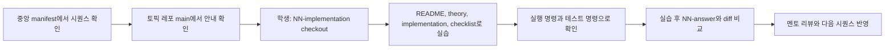

# Branch Strategy

> 메인 README로 돌아가기: [README](../README.md)

이 문서는 A&I 4기 Code Lab의 브랜치 기반 학습 흐름을 정리합니다.
상세 운영 정책은 [강사용 브랜치 정책](./instructor/branch-policy.md), [정답 브랜치 정책](./instructor/answer-branch-policy.md), [시퀀스 실행 프로토콜](./curriculum/sequence-execution-protocol.md)을 기준으로 합니다.

## 브랜치 역할

| 브랜치 | 역할 | 사용자 |
| :--- | :--- | :--- |
| `main` | 토픽 레포 안내 브랜치. 시퀀스 목록, 문서 목록, 브랜치 사용법을 설명합니다. | 학생, 멘토, 운영자 |
| `NN-implementation` | 학생이 실습을 시작하는 starter 브랜치입니다. 핵심 코드에는 순서형 TODO가 들어갑니다. | 학생 |
| `NN-answer` | 완성 코드와 비교 기준을 담는 answer 브랜치입니다. 실습 전 첫 진입점으로 안내하지 않습니다. | 멘토, 실습 완료 학생 |

`NN`은 중앙 시퀀스 번호입니다.
예를 들어 시퀀스 01은 `01-implementation`, `01-answer`를 사용합니다.

## 학생 시작 방식

```bash
git clone <topic-repo-url>
cd <topic-repo-name>
git checkout NN-implementation
```

학생은 먼저 `README.md`, `docs/theory.md`, `docs/implementation.md`, `docs/checklist.md` 순서로 실습합니다.
정답 브랜치는 막혔거나 실습을 마친 뒤 비교용으로만 사용합니다.

## diff 기반 비교 방식

```bash
git fetch origin
git diff NN-implementation..NN-answer
```

이 비교는 정답 코드를 베끼기 위한 절차가 아니라, 학생이 직접 만든 구현과 기준 구현의 차이를 확인하는 회고 절차입니다.
멘토는 diff를 기준으로 아래를 확인합니다.

- TODO가 의도한 핵심 흐름을 학생이 직접 구현했는가
- 문서의 구현 순서와 실제 코드 변경 순서가 연결되는가
- answer와 다른 부분이 버그인지, 허용 가능한 다른 구현인지 구분되는가
- 실패 케이스와 테스트가 같은 학습 목표를 검증하는가

## 운영 흐름



## 멘토 브랜치 관리 기준

- 새 학생 안내에는 legacy `implementation`, `answer` 브랜치명을 사용하지 않습니다.
- 원격 default branch는 `main`이어야 합니다.
- `NN-answer`는 학생 첫 화면이나 Visual Lab 첫 행동 유도 영역에서 과도하게 노출하지 않습니다.
- `NN+1-implementation`은 이전 `NN-answer`의 완성 기준을 이어받아 시작합니다.
- 브랜치 삭제나 default branch 변경은 GitHub UI 수동 조치로 처리합니다.
