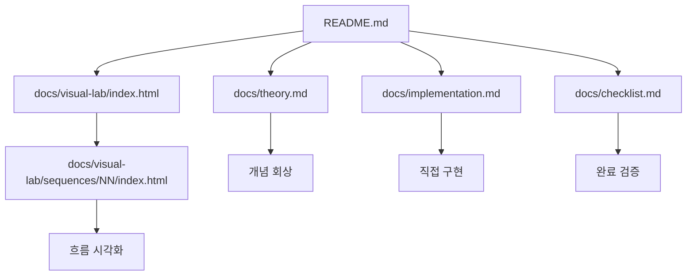

# Documentation Structure

> 메인 README로 돌아가기: [README](../README.md)

이 문서는 4기 Code Lab의 반복 가능한 문서 산출물 기준을 정리합니다.
중앙 `docs`는 상세 이론 저장소가 아니라, 각 토픽 레포가 같은 구조로 학습 자료를 만들도록 기준을 고정합니다.

## 표준 산출물

| 문서/경로 | 목적 | 작성 기준 |
| :--- | :--- | :--- |
| `README.md` | 실습 진입점 | 시퀀스 목표, 시작 브랜치, 실행/테스트 명령, 다음 문서 링크를 먼저 보여줍니다. |
| `docs/theory.md` | 개념과 코드 흐름 연결 | 정의보다 문제 상황, 현재 코드 흐름, 핵심 코드 위치를 먼저 설명합니다. |
| `docs/implementation.md` | 손으로 구현할 순서 | 결과 나열이 아니라 학생이 따라갈 Action 순서와 확인 방법을 보여줍니다. |
| `docs/checklist.md` | 완료 기준 | 학생 체크리스트와 강사/PPT 체크리스트를 분리합니다. |
| `docs/visual-lab/index.html` | 토픽 레포 Visual Lab 허브 | 여러 시퀀스가 있는 레포에서 시각화 진입점을 제공합니다. |
| `docs/visual-lab/sequences/NN/index.html` | 시퀀스 상세 Visual Lab | Problem, Concept, Action, Check 흐름을 정적 HTML로 보여줍니다. |
| `docs/visual-lab/*.css`, `*.js` | Visual Lab 동작과 데이터 | HTML, CSS, Vanilla JavaScript만 사용합니다. |

## 문서 흐름

## 문서별 품질 기준

### theory

- 기초 이론, 현재 코드 흐름, 실무 확장 개념의 3층 구조를 유지합니다.
- 긴 백과사전식 설명보다 이번 실습의 코드와 역할을 연결합니다.
- 이전 시퀀스에서 필요한 용어라도 현재 시퀀스 이해에 필요하면 다시 설명합니다.

### implementation

- 학생이 어느 파일을 열고 무엇을 구현할지 순서대로 보여줍니다.
- TODO는 한 단계씩 따라갈 수 있는 순서형 힌트로 작성합니다.
- 각 구현 단계 뒤에는 Swagger, 테스트, 실행 로그 같은 확인 방법을 붙입니다.

### checklist

- 학생 체크리스트는 직접 실행하거나 말로 설명할 수 있는 항목으로 작성합니다.
- 강사/PPT 체크리스트는 시연, 그림, 질문 대응 포인트를 중심으로 작성합니다.
- 추상적인 "이해했다" 대신 확인 가능한 질문을 사용합니다.

### visual-lab

- 상세 이론이나 answer 코드를 길게 복제하지 않습니다.
- 화면과 데이터 파일에는 `answerBranch`, `sourceAnswerBranch`, `NN-answer` 문자열을 노출하지 않습니다.
- 중앙 레포가 아니라 각 토픽 레포의 `docs/visual-lab` 아래에서 구현합니다.

## 중앙 문서와 토픽 문서의 경계

- 중앙 문서: 순서, 범위, 브랜치, 산출물 기준, 운영 체크리스트
- 토픽 문서: 상세 이론, 구현 단계, 코드, 실행 결과, 시퀀스별 체크리스트

이 경계를 유지해야 다음 기수가 같은 운영 기준을 재사용하면서도 각 토픽의 실습 내용은 독립적으로 개선할 수 있습니다.
