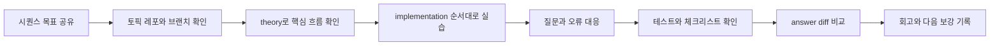

# Session Operation

> 메인 README로 돌아가기: [README](../README.md)

이 문서는 4기 Code Lab 세션 운영 흐름을 요약합니다.
구체적인 체크 항목은 [강사 체크리스트](./instructor/checklist.md)를 기준으로 합니다.

## 코어타임 흐름

## 운영 전 체크리스트

- [ ] 오늘 시퀀스 번호를 확인했습니다.
- [ ] 토픽 레포와 `NN-implementation` 브랜치를 확인했습니다.
- [ ] 실행 명령, 테스트 명령, 필요한 Docker 서비스를 확인했습니다.
- [ ] Visual Lab 허브와 시퀀스 상세 페이지를 확인했습니다.
- [ ] answer 브랜치를 첫 진입점으로 안내하지 않는지 확인했습니다.

## 운영 중 체크리스트

- [ ] 학생이 중앙 레포가 아니라 토픽 레포에서 명령을 실행합니다.
- [ ] 구현 전 `theory.md`로 오늘의 코드 흐름을 확인합니다.
- [ ] `implementation.md`의 TODO 순서대로 실습합니다.
- [ ] 질문 대응은 로그, 테스트 실패 메시지, 문서 단계 순서로 진행합니다.
- [ ] 정답 코드를 먼저 보여주지 않고 학생 구현을 기준으로 점검합니다.

## 운영 후 체크리스트

- [ ] `docs/checklist.md`의 학생 항목을 확인했습니다.
- [ ] `git diff NN-implementation..NN-answer`로 비교했습니다.
- [ ] 학생이 많이 막힌 TODO와 문서 보강 지점을 기록했습니다.
- [ ] 다음 세션 전에 README, theory, implementation, checklist 중 보강할 문서를 결정했습니다.
